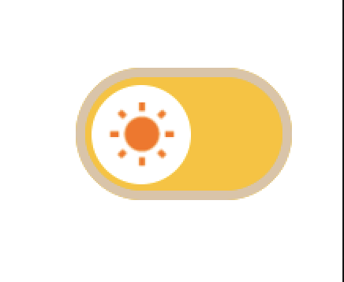
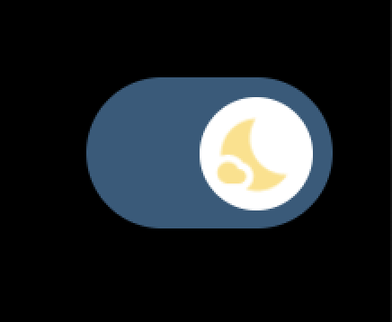

# Animated Theme Toggle (Jetpack Compose)

A reusable animated dark/light mode toggle UI component built using Jetpack Compose and Material 3.

This component provides a smooth transition between light and dark themes and can be easily integrated into Android apps.

---

## ✨ Features

- Animated transition between themes
- Material 3 support
- Simple and reusable composable
- Clean state handling
- Easy integration

---

## 📸 Preview




---

## 🚀 Usage

```kotlin
@Composable
fun ThemeToggle(
    isDark: Boolean,
    onToggle: (Boolean) -> Unit
)
